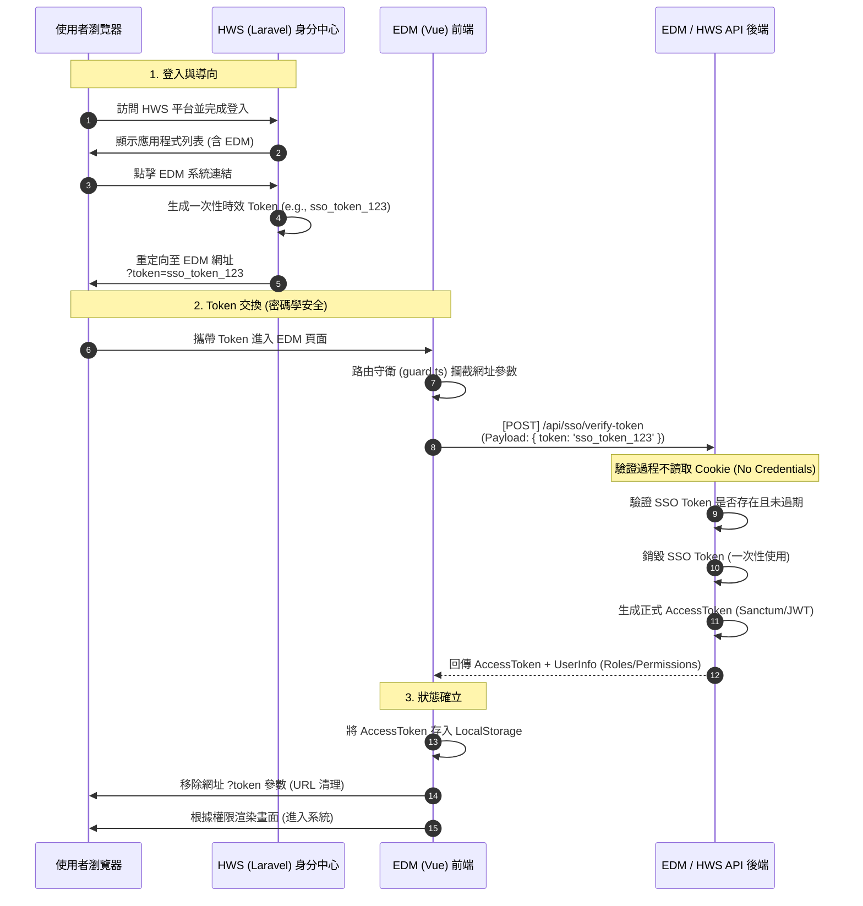

# EDM 系統架構文件 - SSO 認證篇 (Token 交換)

本文件描述 EDM 與 HWS 之間的安全認證流程，採用 **方案 A：Token 交換 (Token Exchange)**，完全規避 CSRF 風險。

---

## 1. 認證流程圖 (Authentication Flow)

使用 Mermaid 編輯器觀看以下序列圖：

---

## 2. 元件職責說明 (System Components)

### A. HWS (Laravel) - 認證發起端
- **職責**：集中管理使用者帳號，確認登入狀態。
- **關鍵行為**：在跳轉至 EDM 時產生 **短期 (60s)**、**一次性 (Cache::pull)** 的 Token。

### B. EDM Frontend (Vue 3 / Vben) - 認證接收端
- **職責**：攔截入口參數，維持本地登入狀態。
- **關鍵行為**：
  - `guard.ts`：攔截 URL 參數。
  - `authStore`：管理 Token 換取行為。
  - **安全性限制**：API 請求不傳遞 `withCredentials`，不依賴網域 Cookie。

### C. EDM / HWS API - 認證驗證端
- **職責**：將臨時鑰匙 (SSO Token) 轉換為正式門票 (Access Token)。
- **關鍵行為**：回傳使用者的角色 (Roles)，供前端動態產生路由選單。

---

## 3. 安全性分析 (Security Audit)

| 安全控制項 | 實作細節 |
| :--- | :--- |
| **CSRF 防禦** | 完全不使用 Cookie 進行認證。請求頭使用 `Authorization: Bearer`。 |
| **Token 洩漏防禦** | SSO Token 為一次性使用，且透過 HTTPS 傳輸。 |
| **URL 清理** | 前端在換到 Token 後立即 `router.replace` 移除參數，防止重新整理或分享網址時洩漏。 |
| **權限控管** | 每次 API 調用均需通過後端對 Access Token 的解析與權限校驗。 |

---

## 4. 維護建議

- **網域異動**：若環境變遷，請更新 `.env` 中的 `VITE_HWS_URL`。
- **時效調整**：建議 SSO Token 時效維持在 60 秒以內，以達到最佳安全性。
