# HWS (Laravel) 與 EDM (Vue) SSO 整合實作計畫書 (Token 交換方案)

本計畫書旨在建立一套安全、可靠且防禦 CSRF 的單一登入 (SSO) 機制。我們捨棄了依賴 Cookie 的 Session 共用方案，改採 **「Token 交換機制 (Token Exchange)」**。

---

## 1. 核心流程概覽

```mermaid
sequenceDiagram
    participant HWS as HWS (Laravel)
    participant User as 使用者瀏覽器
    participant EDM as EDM (Vue 3)
    
    User->>HWS: 1. 登入 HWS 並點擊 EDM 系統連結
    HWS->>HWS: 2. 生成短期一次性 SSO Token
    HWS->>User: 3. 重定向至 EDM (?token=SSO_TOKEN)
    User->>EDM: 4. 攜帶 Token 進入系統
    EDM->>HWS: 5. [POST] /sso/verify-token (交換正式 Token)
    HWS-->>EDM: 6. 回傳正式 AccessToken + 使用者資訊
    EDM->>EDM: 7. 存入 LocalStorage，移除網址參數，進入系統
```



---

## 2. Laravel (HWS) 端實作清單

### A. 導向 EDM 的跳轉邏輯
在產生導向 EDM 的連結時，請夾帶由後端生成的隨機 `token`。

```php
// Laravel 範例
public function redirectToEdm() {
    $ssoToken = Str::random(40);
    
    // 將 Token 與 User ID 綁定，設定 60 秒效期
    Cache::put("sso_token_{$ssoToken}", Auth::id(), 60);

    $edmUrl = config('app.edm_url'); // e.g., https://uatedm.hwacom.com
    // ✅ History 模式：直接在直路徑後加參數，不需 /#/
    return redirect("{$edmUrl}/?token={$ssoToken}");
}
```

### B. 實作 Token 驗證 API
新增一個不需要 CSRF 保護的 API 介面（建議放在 `routes/api.php`）。

### C. CORS 配置 (重要)
由於 EDM 與 HWS 位於不同網域，Laravel 必須允許來自 EDM 網域的請求。請修正 `config/cors.php`：

```php
'paths' => ['api/*', 'sanctum/csrf-cookie'],
'allowed_methods' => ['*'],
'allowed_origins' => ['https://uatedm.hwacom.com', 'https://edm.hwacom.com'], // 填入您的 EDM 網域
'allowed_origins_patterns' => [],
'allowed_headers' => ['*'],
'exposed_headers' => [],
'max_age' => 0,
'supports_credentials' => false, // 方案 A 不需 Cookie，設為 false 更安全
```

```php
// API 路由: POST /api/sso/verify-token
public function verifyToken(Request $request) {
    // 1. 使用 Cache::pull 確保 Token 驗證後立即失效 (一次性)
    $userId = Cache::pull("sso_token_{$request->token}");
    
    if (!$userId) {
        return response()->json([
            'code' => -1,
            'message' => 'Token 無效或已過期',
            'data' => null
        ], 401);
    }

    $user = User::find($userId);
    
    // 2. 生成正式的 API 訪問 Token (如 Sanctum 或 JWT)
    $accessToken = $user->createToken('edm-access')->plainTextToken;

    // 3. ✅ 重要：回傳前端所需的標準格式 (須包裹在 data 中且 code 為 0)
    return response()->json([
        'code' => 0,
        'message' => 'ok',
        'data' => [
            'accessToken' => $accessToken,
            'userInfo' => [
                'userId' => $user->id,
                'realName' => $user->name,
                'roles' => $user->getRoleNames(), // 必須包含權限角色
                'homePath' => '/dashboard/analysis', // 登入後的導向頁面
            ]
        ]
    ]);
}
```

---

## 3. Vue (EDM) 端更新說明 (已由 AI 完成)

### A. 路由守衛攔截 (`src/router/guard.ts`)
系統會在進入任何頁面前優先檢查網址是否有 `token`：
- 若有 Token：呼叫 `authStore.ssoLogin(token)`。
- 若驗證成功：跳轉回原目標頁面（並自動移除網址上的 Token 參數）。

### B. 請求配置 (`src/api/request.ts`)
- **安全性**：所有 API 請求**不開啟** `withCredentials`。
- **認證**：使用 `Authorization: Bearer <token>` Header。這確保了系統完全免疫 CSRF 攻擊。

---

## 4. 驗證步驟

1. **第一階段**：在 Laravel 手動產生一個 Cache Token，並手動在瀏覽器輸入 `https://uatedm.hwacom.com/#/?token=TEST_TOKEN`。
2. **第二階段**：觀察 Network 面板是否發出 `/sso/verify-token` 請求。
3. **第三階段**：確認 EDM 網址是否變回乾淨的狀態，且成功進入 Dashboard。

---

## 5. 混合網路架構建議 (Public EDM + Private HWS)

由於 EDM 系統需要處理 AWS 郵件狀態追蹤，必須對外聯網；而 HWS (Laravel) 位處內網。在這種「非對稱網路」環境下，Token 交換方案具有以下優勢：

### A. 為什麼這比 Cookie 方案更穩健？
- **Cookie 限制**：若使用 Cookie 方案，當使用者從外部網路存取 EDM 時，瀏覽器會因為無法連線至內網 HWS 而導致身份校驗失敗。
- **Token 結耦**：Token 交換是「伺服器對伺服器」的驗證。使用者只需在「具備內網權限」時點擊連結完成跳轉，隨後即使在外部網路存取 EDM，EDM 後端也會透過內部通道或專屬 API 與 HWS 溝通，使用者端不需要再接觸內網。

### B. 安全配套建議
- **伺服器連線**：確保 EDM (公網伺服器) 的後端具備存取 HWS (內網) `/api/sso/verify-token` 的權限（可透過內部 VPN 或防火牆許可清單實作）。
- **HTTPS 強化**：因 Token 會在網際網路上傳遞，全流程必須強制開啟 HTTPS 以防範攔截。

---

## 6. 安全性備註 (Security Note)

> [!IMPORTANT]
> 此方案透過 **「Header-based Auth」** 徹底避開了瀏覽器對 Cookie 的自動處理。惡意網站無法讀取您的 LocalStorage，也無法偽造自定義 Header，因此這是 SPA 與 API 分離架構下最安全的實作方式。
