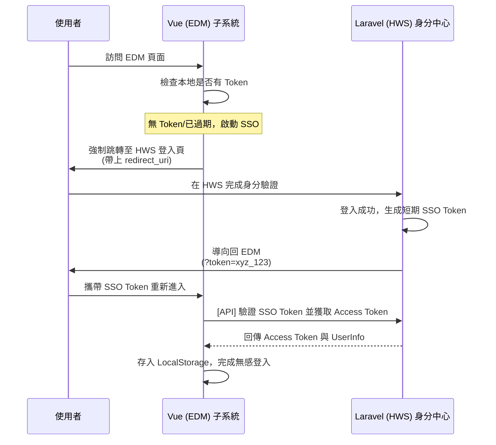

# HWS (Laravel) 與 EDM (Vue) SSO 整合技術指南 (無本地登入模式)

本指南詳細紀錄如何實作「一套系統登入，全處通行」，並完全移除 EDM 的本地登入介面，統一由 HWS 作為權限入口。

---

## 1. 互動流程圖 (Sequence Diagram)

我們採用 **Token 交換模式** 來達成安全的身分同步：



---

## 2. 移除本地登入機制

為了確保使用者只能從 HWS 進入，我們需要禁用 EDM 本地的登入入口。

### A. 路由強制跳轉
修改 `src/router/guard/authGuard.ts`（或相關的路由守衛），攔截對 `/login` 的訪問。

```typescript
// src/router/guard/authGuard.ts
if (to.path === '/login') {
  // 不顯示 EDM 的登入表單，直接彈到 HWS 登入中心
  const redirectUri = window.location.origin;
  window.location.href = `https://hws.example.com/login?redirect_uri=${redirectUri}`;
  return;
}
```

### B. 清除 API 登入定義
在 `src/api/core/auth.ts` 中，將原有的 `loginApi` 替換為 `verifySsoTokenApi`。

---

## 3. Laravel (HWS) 端實作

### A. 登入後的 SSO Token 生成
在 Laravel 的 `LoginController` 中，登入成功後若偵測到 `redirect_uri`，則發放 SSO Token。

```php
// Laravel Controller
public function authenticated(Request $request, $user) {
    if ($request->has('redirect_uri')) {
        $ssoToken = Str::random(40);
        // SSO Token 必須極短時間（如 60 秒）且只能使用一次
        Cache::put("sso_token_{$ssoToken}", $user->id, 60);

        return redirect($request->redirect_uri . "?token=" . $ssoToken);
    }
    return redirect('/home');
}
```

### B. 提供 Token 驗證 API
```php
Route::post('/sso/verify-token', function (Request $request) {
    $userId = Cache::pull("sso_token_{$request->token}");
    if (!$userId) return response()->json(['message' => 'Invalid Token'], 401);

    $user = User::find($userId);
    // 生成給 EDM 專用的 Access Token
    $accessToken = $user->createToken('edm-session')->plainTextToken;

    return response()->json([
        'accessToken' => $accessToken,
        'userInfo' => ['userId' => $user->id, 'realName' => $user->name]
    ]);
});
```

---

## 4. Session 生存時間 (TTL) 與自動刷新

為了達成「操作中不登出，閒置即登出」的體驗：

### A. API 行為自動續期 (Interceptor)
修改 `src/api/request.ts`。每當使用者呼叫 API，代表其正在活動中，我們自動更新本地的活動紀錄。

```typescript
// src/api/request.ts (Request Interceptor)
client.addRequestInterceptor({
  fulfilled: async (config) => {
    // 1. 每次有 API 行為，重置「最後活動時間」
    localStorage.setItem('edm_last_activity', Date.now().toString());
    
    // 2. 在 Header 告知後端也延長後端的 Session (如果後端支援)
    config.headers['X-Renew-Session'] = '1'; 
    
    return config;
  },
});
```

### B. 閒置檢查與自動退場
在 `src/store/auth.ts` 或應用頂層監控活動紀錄。

```typescript
// 定時檢查 (例如每 1 分鐘檢查一次)
setInterval(() => {
  const lastActivity = parseInt(localStorage.getItem('edm_last_activity') || '0');
  const now = Date.now();
  const idleTimeout = 30 * 60 * 1000; // 設定 30 分鐘閒置

  if (now - lastActivity > idleTimeout) {
     // 超過 30 分鐘沒動靜，執行登出並跳回 HWS
     useAuthStore().logout();
  }
}, 60000);
```

---

## 🛡️ 安全注意事項
1.  **Token 一次性**：在 Laravel 端驗證時務必使用 `Cache::pull` 確保 SSO Token 驗證後立即失效。
2.  **HTTPS**：所有跨系統的 Token 傳遞與 API 呼叫必須在 HTTPS 下進行。
3.  **登出連動**：當使用者在 HWS 點擊「登出」時，應透過 Redis 共享狀態或 API 通知方式，讓 EDM 的 Access Token 同步失效。
